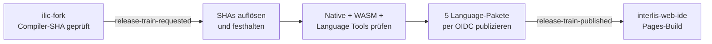

# Build- und Publikationspipeline

[Projektübersicht](../README.md) · [Release-Betrieb](release.md) ·
[Teststrategie](testing.md)

Dieses Repository koordiniert den zweiten Schritt des Release-Trains. Es baut
und prüft die beiden Compiler-Pakete aus `ilic-fork` als Eingabe, publiziert
aber nur die fünf eigenen Language-Tools-Pakete. Die Compiler-Pakete werden
vorher aus `ilic-fork` selbst per OIDC publiziert. Erst danach wird der
GitHub-Pages-Build von `interlis-web-ide` gestartet.



## Workflows und Verantwortung

| Workflow                                                                                      | Trigger                                                | Verantwortung                                                                                     |
| --------------------------------------------------------------------------------------------- | ------------------------------------------------------ | ------------------------------------------------------------------------------------------------- |
| [`.github/workflows/ci.yml`](../.github/workflows/ci.yml)                                     | Push auf `main` oder `codex/**` (ausser reine Markdown-Änderungen), Pull Request (ausser reine Markdown-Änderungen), manuell | Workspace, npm-Tarballs und universelle VSIX prüfen; installierbare Artefakte 14 Tage aufbewahren |
| [`.github/workflows/publish-npm-snapshot.yml`](../.github/workflows/publish-npm-snapshot.yml) | Push auf `main` (ausser reine Markdown-Änderungen), `release-train-requested`, manuell    | Exakte Quellstände bauen, fünf Language-Pakete publizieren und Web IDE dispatchen                |
| [`.github/workflows/release.yml`](../.github/workflows/release.yml)                           | nur manuell                                            | VSIX bauen und unabhängig zu VS Code Marketplace und Open VSX publizieren                         |

CI, npm-Snapshots und Extension-Veröffentlichung sind getrennte Abläufe. Ein
grüner CI-Artefakt wird nicht ungeprüft weitergereicht: Der Release-Train baut
die ausgewählten Quellen selbst neu. Die Extension-Publikation ist ebenfalls
kein Nebeneffekt eines npm-Snapshots.

Alle push- und pull-request-basierten CI-Trigger ignorieren mit
`paths-ignore: "**/*.md"` reine Markdown-Änderungen. Gemischte Commits mit
Code- oder Konfigurationsänderungen starten weiterhin die vollständige Prüfung.
Der koordinierte Release-Dispatch und manuelle Läufe bleiben unabhängig von
diesem Filter.

## CI: Workspace und auslieferbare Artefakte

Der Job `verify` läuft mit Node 22 und pnpm 11.14.0 auf Ubuntu. Er checkt den
aktuellen Language-Tools-Commit und den Default-Branch von `ilic-fork` als
Geschwisterverzeichnisse aus.

Die Gates laufen in dieser Reihenfolge:

1. die in `ilic-fork/.emscripten-version` festgelegte Emscripten-Version
   installieren und Compiler-WASM bauen;
2. `pnpm install --frozen-lockfile` ausführen;
3. mit `pnpm check` alle Pakete bauen, linten, typprüfen und testen sowie die
   deterministischen Snapshot-Tests ausführen;
4. die Coverage von `@ilic/language-service` erzeugen und 14 Tage als Artefakt
   hochladen;
5. mit `pnpm pack:verify` alle sieben npm-Tarballs stagen, in einem leeren
   Consumer installieren und ihre öffentlichen Entry-Points ausführen;
6. mit `pnpm package:vsix` die universelle Extension bauen und ihren Inhalt
   prüfen;
7. Produktionslizenzen und Abhängigkeiten mit `pnpm licenses:check` und
   `pnpm security:check` prüfen;
8. VSIX und npm-Tarballs als `interlis-language-tools-<SHA>` für 14 Tage
   hochladen.

Der Coverage-Schritt ist aktuell `continue-on-error`: Der Bericht wird immer
erzeugt, ein Unterschreiten der Zielwerte blockiert CI und Publikation aber
noch nicht. Alle anderen genannten Gates sind blockierend. Details zu Umfang
und Schwellenwerten stehen in der [Teststrategie](testing.md).

## Koordinierten Release-Train starten

Der Publish-Workflow serialisiert alle Läufe in der Concurrency-Gruppe
`release-train`; ein neuer Lauf bricht einen laufenden nicht ab. Er kann auf
drei Wegen beginnen:

| Ereignis                              | Compiler-Revision                                              | Language-Tools-Revision                                                    |
| ------------------------------------- | -------------------------------------------------------------- | -------------------------------------------------------------------------- |
| Push auf `main`                       | `gitHead` der einmalig vom npm-`snapshot`-Tag aufgelösten Compiler-Version (sonst Compiler-`main`) | exakter Event-SHA des Pushs |
| `repository_dispatch` aus `ilic-fork` | `client_payload.compiler_sha` und `client_payload.compiler_version` | aktueller Language-Tools-SHA, zu Beginn auf einen vollständigen Commit aufgelöst |
| manueller Start                       | optionaler vollständiger `compiler_sha` und `compiler_version`, sonst Compiler-`main` und aktueller npm-Compiler-Snapshot | optionaler vollständiger `language_tools_sha`, sonst Language-Tools-`main` |

`resolve-refs` akzeptiert nur vollständige, 40-stellige Commit-SHAs. Seine
Outputs werden für alle folgenden Checkouts verwendet. Damit bleibt die
Quellpaarung innerhalb eines Laufs stabil, auch wenn danach ein Branch
weitergeschoben wird.

Ein `main`-Push kann weiterhin einen Language-only-Snapshot erzeugen. Der
koordinierte Compiler-Weg kommt ausschliesslich über den Dispatch aus dem
erfolgreichen `ilic-fork`-Publish und enthält bereits die unveränderliche
Compiler-Version. Der bewegliche npm-Tag wird nur bei Push/Manual zur einmaligen
Auflösung verwendet; danach arbeitet der Lauf nur noch mit der exakten Version.

## Build- und Verifikationsphase des Release-Trains

Der `build`-Job läuft auf Ubuntu und verwendet genau die aufgelösten SHAs.

### Compiler

Zuerst installiert der Job `libcurl`, `libxml2` und Ninja. Er konfiguriert
einen nativen Release-Build, baut ihn und führt CTest aus:

```sh
cmake -S . -B build/release-train -G Ninja -DCMAKE_BUILD_TYPE=Release
cmake --build build/release-train --parallel
ctest --test-dir build/release-train --output-on-failure
```

Danach wird mit der im Compiler-Repository gepinnten Emscripten-Version der
WASM-Compiler neu gebaut. Der Release-Train verwendet somit weder ein bewegtes
npm-Tag noch ein Binärartefakt aus einem anderen Workflow.

### Language Tools und Supply-Chain-Gates

Mit Node 24 und pnpm 11.14.0 folgen ein eingefrorener Lockfile-Install,
`pnpm check`, der nicht blockierende Coverage-Bericht sowie Lizenz- und
Vulnerability-Prüfung. Erst wenn diese Schritte erfolgreich sind, wird ein
UTC-Zeitstempel gewählt und `pnpm pack:verify` mit folgenden Werten gestartet:

```text
SNAPSHOT_TIMESTAMP=YYYYMMDDHHmmss
SNAPSHOT_BUILD_ID=<GitHub-Run-ID>
```

Der Stager verändert keine eingecheckten Manifeste. Er erzeugt unter
`artifacts/npm/` sieben Tarballs mit zwei Basisversionslinien. Compiler- und
Language-Pakete behalten dabei bewusst getrennte Zeitstempel und Run-IDs:

| Paketgruppe    | Pakete                                                                                                   | Version                               |
| -------------- | -------------------------------------------------------------------------------------------------------- | ------------------------------------- |
| Compiler       | `@ilic/tools`, `@ilic/compiler-wasm`                                                                     | exakte publizierte `compilerVersion` aus dem Dispatch |
| Language Tools | `@ilic/language-service`, `@ilic/monaco-adapter`, `@ilic/diagram`, `@ilic/docx`, `@ilic/language-server` | `0.1.0-SNAPSHOT.<language-timestamp>.<language-run-id>` |

Alle internen Abhängigkeiten in den gepackten Manifesten zeigen auf exakte
Snapshot-Versionen. `workspace:*`, `file:`, Dist-Tags und Versionsbereiche für
interne `@ilic/*`-Pakete werden abgelehnt. `pack:verify` installiert alle
Tarballs zusammen in einem sauberen Consumer und führt den echten
WASM-Compiler sowie die öffentlichen APIs aus.

### Manifeste und Buildartefakt

`snapshot-manifest.json` enthält Versionen, Zeitstempel, Build-ID und die
Paketliste. Der Workflow erweitert es zu `release-manifest.json` um:

- `compilerSha`;
- `languageToolsSha`;
- `releaseRunId`.

Tarballs und beide Manifeste werden als
`interlis-release-<GitHub-Run-ID>` 14 Tage gespeichert. Dieses Artefakt ist die
verbindliche Spur zwischen Quellständen, erzeugten Dateien und Publikation.

## npm-Publikation

Der getrennte `publish`-Job lädt ausschliesslich das zuvor verifizierte
Release-Artefakt herunter. Er verwendet Node 24 und die festgelegte
npm-Version 11.18.0. Nur dieser Job erhält `id-token: write`; npm
authentisiert ihn über Trusted Publishing und veröffentlicht Provenance. Ein
`NPM_TOKEN` oder `NODE_AUTH_TOKEN` ist nicht erforderlich.

Publiziert wird mit `--access public --tag snapshot` in Abhängigkeitsreihenfolge
nur für die fünf Language-Tools-Pakete:

1. `@ilic/language-service`;
2. `@ilic/monaco-adapter`;
3. `@ilic/diagram`;
4. `@ilic/docx`;
5. `@ilic/language-server`.

Vor jedem Publish fragt der Workflow die exakte Paketversion bei npm ab. Ist
sie bereits vorhanden, wird sie übersprungen. Das macht die Wiederholung eines
teilweise erfolgreichen Laufs möglich, ohne eine unveränderliche npm-Version
zu überschreiben.

Nach der Paketpublikation validiert der Job das Release-Manifest und sendet das
Ereignis `release-train-published` an `interlis-web-ide`. Der Payload enthält:

```json
{
  "compiler_sha": "<SHA>",
  "language_tools_sha": "<SHA>",
  "compiler_version": "0.9.9-SNAPSHOT....",
  "language_tools_version": "0.1.0-SNAPSHOT....",
  "timestamp": "YYYYMMDDHHmmss",
  "build_id": "<Run-ID>",
  "release_run_id": "<Run-ID>"
}
```

Der Dispatch erfolgt nach der Publikation der fünf Language-Pakete; die beiden
Compiler-Pakete wurden zuvor aus `ilic-fork` publiziert. Fehlt das Secret
`RELEASE_DISPATCH_TOKEN` oder scheitert der API-Aufruf, können die Pakete daher
bereits vollständig publiziert sein. Ein erneuter Lauf mit derselben
Workflow-Run-ID überspringt vorhandene Versionen und kann die Übergabe erneut
versuchen; ein komplett neuer Lauf erzeugt einen neuen Zeitstempel.

Der nachgelagerte Build ist im
[Web-IDE-Repository](https://github.com/edigonzales/interlis-web-ide/blob/main/docs/build-und-publikationspipeline.md)
dokumentiert.

## VS-Code-Extension separat publizieren

`Publish VS Code extension` wird manuell gestartet. Die Eingabe `pre_release`
steuert, ob `vsce package` die VSIX als Marketplace-Pre-Release markiert.
Der Build-Job baut Compiler-WASM und Workspace neu, führt `pnpm check`,
VSIX-Inhaltsprüfung, Lizenzprüfung und Security-Audit aus und lädt die geprüfte
`interlis-language-tools.vsix` hoch.

Danach laufen zwei unabhängige Jobs:

- mit `VSCE_PAT` Publikation in den VS Code Marketplace;
- mit `OVSX_PAT` Publikation in Open VSX.

Fehlt eines der Secrets, wird nur dessen externer Publish übersprungen; die
VSIX und der jeweils andere Zielkanal bleiben erhalten. Ein Marketplace- oder
Open-VSX-Release ändert keine npm-Version und löst keinen Web-IDE-Deploy aus.

## Berechtigungen und Secrets

| Berechtigung oder Secret | Verwendungsort      | Zweck                                       |
| ------------------------ | ------------------- | ------------------------------------------- |
| `contents: read`         | alle Jobs           | Quellen auschecken                          |
| `id-token: write`        | nur npm-Publish-Job | kurzlebige npm-OIDC-Authentisierung         |
| `RELEASE_DISPATCH_TOKEN` | npm-Publish-Job     | `repository_dispatch` an `interlis-web-ide` |
| `VSCE_PAT`               | Marketplace-Job     | VSIX zu VS Code Marketplace publizieren     |
| `OVSX_PAT`               | Open-VSX-Job        | VSIX zu Open VSX publizieren                |

Der Compiler-Dispatch in dieses Repository wird mit dem gleichnamigen Secret
im `ilic-fork`-Repository authentisiert. GitHub Pages benötigt kein Secret aus
diesem Repository.

`RELEASE_DISPATCH_TOKEN` ist ein GitHub-API-Token für den
Cross-Repository-Dispatch, kein npm-Token. Das Secret dieses Repositories wird
unter `Settings → Secrets and variables → Actions` gespeichert und darf nur
`edigonzales/interlis-web-ide` dispatchen. Für ein empfohlenes Fine-grained
Token wird ausschließlich dieses Ziel-Repository mit
`Contents: Read and write` ausgewählt. Das Gegenstück im Compiler-Repository
heißt ebenfalls `RELEASE_DISPATCH_TOKEN`, darf aber nur den Dispatch an dieses
Repository auslösen. npm Trusted Publishing verwendet weiterhin OIDC und
benötigt dieses Secret nicht.

## Pinning und lokale Abweichungen

Beim koordinierten Dispatch ist der Compiler bereits gepinnt: `compiler_sha`
ist ein vollständiger Commit und `compiler_version` eine unveränderliche npm-
Version aus der erfolgreichen `ilic-fork`-Publikation. Das Skript liest aus
dieser Version auch den Compiler-Zeitstempel und die Compiler-Run-ID. Die
Language-Tools-Version verwendet dagegen den eigenen UTC-Zeitstempel und die
eigene Run-ID. Beide Werte werden im `release-manifest.json` getrennt geführt.

Bei Push oder manuellem Start ohne Payload wird der bewegliche npm-Tag
`@ilic/tools@snapshot` einmalig auf eine konkrete Version aufgelöst und für den
gesamten Lauf verwendet. Ein späteres Verschieben des Tags beeinflusst diesen
Lauf nicht mehr. Die fünf publizierten Language-Pakete referenzieren immer die
exakte Compiler-Version und niemals `snapshot`, `workspace:*`, `file:` oder
eine Versionsrange.

Lokal existiert kein GitHub-OIDC-Trusted-Publisher-Kontext. `pnpm pack:verify`
erzeugt lokale Tarballs aus den Geschwisterverzeichnissen und kann ohne npm-
Publikation erfolgreich sein. Nicht gesetzte lokale Variablen erhalten
Fallback-Werte; in GitHub Actions können dagegen leere Event-Felder gesetzt
sein. Das Verifikationsskript behandelt leere Werte deshalb wie nicht gesetzte
Werte. Ein lokaler Erfolg beweist somit weder die npm-Berechtigung noch die
Übereinstimmung von Repository, Workflow-Datei und Provenance.

## Lokal dieselben Gates ausführen

Die drei Repositories müssen als Geschwisterverzeichnisse vorliegen. Nach
Aktivierung der zum Compiler passenden Emscripten-Umgebung:

```sh
cd ../ilic-fork
./scripts/build-wasm.sh

cd ../interlis-language-tools
corepack pnpm install --frozen-lockfile
corepack pnpm check
corepack pnpm --filter @ilic/language-service test:coverage
corepack pnpm pack:verify
corepack pnpm package:vsix
corepack pnpm licenses:check
corepack pnpm security:check
```

Für release-identische Versionsnamen können Zeitstempel und numerische
Build-ID explizit gesetzt werden:

```sh
SNAPSHOT_TIMESTAMP=20260721120000 \
SNAPSHOT_BUILD_ID=123456789 \
corepack pnpm pack:verify
```

## Fehler- und Recovery-Modell

- Vor erfolgreichem `build`-Job wird nichts publiziert.
- Der Coverage-Bericht ist informativ; alle anderen Build-, Test-, Paket-,
  Lizenz- und Security-Schritte blockieren.
- npm besitzt keine Transaktion über sieben Pakete. Einen Teilfehler durch
  erneutes Ausführen beheben; nichts automatisch unpublishen.
- Bereits vorhandene exakte Versionen werden übersprungen. Unterschiedlicher
  Inhalt darf nie unter derselben Version publiziert werden.
- Ein fehlgeschlagener Web-IDE-Dispatch macht publizierte Pakete nicht
  rückgängig. Nach Behebung des Tokens oder Ziel-Workflows wird der
  Release-Train erneut ausgeführt.
- Das manuelle Verschieben von `latest` und der einmalige Trusted-Publisher-
  Bootstrap sind betriebliche Nacharbeiten und unter
  [Release-Betrieb](release.md) beschrieben.
